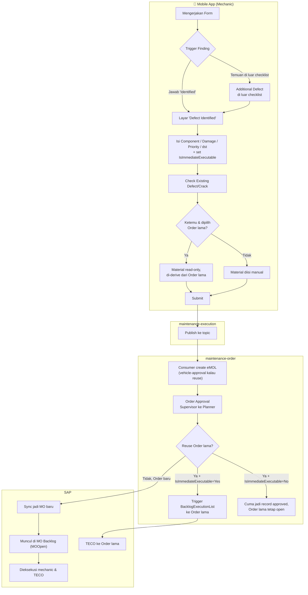

# Epic: Order Integration (Form-Centric Defect/Crack → Order)

Draft epic dari hasil requirement discussion yang sudah **tuntas didesain** (14/14 poin di [checklist](order-integration-checklist.md) resolved) di [order-integration.md](order-integration.md). Body epic ini sengaja ringkas — detail teknis & acceptance criteria implementasi ada di masing-masing [Child Story](#child-stories-draft) di bawah. **Sudah di-generate ke Jira** — lihat [IAMS30-4774](https://bukittechnology.atlassian.net/browse/IAMS30-4774).

*Last updated: 2026-08-18*

---

## Jira Fields

| Field | Value |
|---|---|
| Jira Key | [IAMS30-4774](https://bukittechnology.atlassian.net/browse/IAMS30-4774) |
| Project | `IAMS30` |
| Issue Type | Epic |
| Epic Name | Order Integration — Form-Centric Defect/Crack |
| Priority | High |
| Fix Version / Sprint | Backlog (belum ditarik ke sprint aktif) |
| Labels | `order-integration`, `service-sheet` |
| Epic Owner / Reporter | Okky Rizki Rohayat |
| Assignee | Unassigned (di-assign nanti pas sprint planning) |

**Catatan:** diagram [End-to-End User Journey](#end-to-end-user-journey) di bawah pakai Mermaid — render langsung di GitHub/VSCode, tapi Jira description tidak render Mermaid native. Export jadi gambar (PNG) dulu sebelum attach ke description saat generate ke Jira.

---

## Summary

Sambungkan UI "Defect Identified" yang sudah dibangun di mobile app (v4.0.0) tapi belum functional, ke backend — supaya jawaban defect/crack pada Form Task tertentu di Form apa pun (Inspection, PM Shutdown, BD Corrective, dan future caller lain) otomatis tercatat sebagai Finding, dan bila relevan otomatis membentuk Order (eMOL) yang mengikuti approval flow sampai sync ke SAP — termasuk mekanisme reuse Order lama supaya tidak terjadi duplicate Order untuk defect yang sama.

## Istilah Kunci

Istilah teknis yang dipakai berulang di epic ini (termasuk di Child Story) — dibaca dulu supaya tidak perlu loncat ke dokumen lain:

| Istilah | Arti |
|---|---|
| **Form Task** | 1 baris/item di dalam Form yang sedang dikerjakan mechanic (dulu disebut informal "Question" — dikoreksi karena isinya tidak selalu berupa pertanyaan, kadang instruksi kerja). 1 Form terdiri dari banyak Form Task. |
| **TaskKit** | Tipe suatu Form Task, menentukan opsi jawaban yang tersedia (mis. dropdown "Condition"). Ada 7 TaskKit total; cuma 3 yang masuk scope epic ini. |
| **Finding** | Catatan defect/crack yang dibuat mechanic, disimpan di tabel `TaskPersonalizedFinding` (service `maintenance-execution`). |
| **`TaskPersonalized`** | Record yang merepresentasikan 1 mechanic yang sedang/telah mengerjakan 1 Form — parent wajib bagi Finding. |
| **eMOL** | Istilah internal Digiman+ untuk "Order" versi Digiman+ (tabel `MechanicOrderList`, service `maintenance-order`), **sebelum** benar-benar di-push jadi MO di SAP. 1 Finding yang trigger Order = 1 eMOL. |
| **MO (Maintenance Order)** | Order yang sudah ada di sisi **SAP**. eMOL baru jadi MO setelah lolos approval & sync — nomor MO dari SAP beda dari nomor eMOL Digiman+. |
| **`IsImmediateExecutable`** | Flag dari mechanic: "saya sedang/sudah mengerjakan perbaikan ini sekarang juga" (fakta eksekusi, bukan rencana/janji). Kalau `Yes`, ada 3 kombinasi yang disebut berulang di epic ini: **Sub-kasus A** (Order lama ditemukan & di-reuse), **Sub-kasus B1** (Order baru, tidak butuh material), **Sub-kasus B2** (Order baru, butuh material — tetap harus lewat approval standar dulu sebelum material bisa diambil dari logistic, walau diprioritaskan/expedited). |
| **TECO** | *Technical Completion* — istilah SAP untuk menutup/menyelesaikan sebuah MO setelah eksekusi fisiknya selesai. |
| **`PMActType`** | Field "Activity Type" di sisi SAP, dikirim sebagai bagian data saat Order di-sync ke SAP. |
| **Topic / publish-consume** | Mekanisme antar-service asinkron (service bus): 1 service *publish* event ke "topic", service lain *consume* (baca) event itu belakangan. Dipakai supaya 1 aksi Save tidak perlu memanggil 2 service sekaligus (menghindari race condition). |
| **`PoolingMOItem`** | Tabel staging di `maintenance-order` — tempat data eMOL yang sudah approved disiapkan sebelum benar-benar di-push jadi MO ke SAP. |
| **`MOOpen`** | Daftar MO yang masih terbuka/outstanding di SAP — sumber data "MO Backlog" yang dieksekusi mechanic sehari-hari. |
| **WorkOrder** | Unit kerja utama di `maintenance-execution` (mis. dari Inspection) yang jadi konteks Form/Task sedang dikerjakan. |
| **Additional Order** | Flow existing (di luar epic ini) untuk defect yang dilaporkan tanpa keterkaitan ke WorkOrder/Task tertentu — semua field diisi manual, `Type='Additional'`. |
| **Permission code** | Digiman+ tidak mengecek akses berdasarkan role/jabatan yang di-hardcode — siapapun yang di-*assign* ke suatu permission code bisa melakukan aksi terkait, apapun jabatannya. |
| **Companion Name column** | Kolom baru berisi nama yang *human-readable*, ditambahkan berdampingan dengan kolom Code yang sudah ada (mis. `DamageCode` sudah ada → `DamageName` baru) — supaya UI tidak perlu translate Code ke Name secara live. |
| **GI (Goods Issue)** | Proses di SAP saat material benar-benar keluar dari gudang untuk suatu MO — jadi syarat yang mungkin perlu dicek sebelum MO bisa di-TECO, kalau MO itu butuh material. |
| **BPO (Business Process Owner)** | Pihak di sisi **client** yang berwenang mengonfirmasi aturan bisnis (mis. jumlah tingkat approval) — bukan tim internal Digiman+. |
| **Backfill** | Mengisi kolom yang baru ditambahkan dengan nilai untuk data **historis** (record lama, dari sebelum kolom itu ada) — bukan cuma berlaku ke data baru ke depan. |
| **Stale-candidate** | Kandidat Order lama yang sempat disarankan untuk di-reuse, tapi statusnya berubah (mis. sudah dipakai/closed) sebelum user benar-benar submit — karena itu perlu divalidasi ulang persis di titik submit final, bukan cukup sekali di awal. |

## Background / Problem Statement

Phase 1 ([pm-shutdown-service-package.md](../phase1-service-package/pm-shutdown-service-package.md)) men-defer skenario mechanic yang sedang melakukan service rutin dan menggunakan form menemukan finding — defect atau crack — ke MVP berikutnya. UI Finding creation sudah ada di mobile app dan field-nya sudah match skema `TaskPersonalizedFinding`/`CrackIdentified`, tapi **Save belum tersambung ke backend** — tidak menyimpan data, tidak trigger Order apapun. Tanpa integrasi ini, defect/crack yang ditemukan mechanic di lapangan tidak tercatat sistematis dan tidak bisa ditindaklanjuti jadi Order/WorkOrder SAP dari dalam form.

Menyambungkan Save ke backend saja tidak cukup kalau tiap defect/crack yang ditemukan langsung diperlakukan sebagai Order baru — defect yang sama bisa saja sudah pernah dilaporkan sebelumnya dan masih punya Order yang open. Ini bukan risiko teoretis: data production mengonfirmasi kolom `DeleteReason` pada data existing berisi `"double order"` secara berulang — bukti bahwa duplicate Order untuk defect yang sama sudah jadi masalah operasional hari ini, yang selama ini dibersihkan manual. Karena itu, mekanisme correlation/reuse jadi bagian utama epic ini, bukan sekadar defensive design tambahan.

### Bukti UI Existing (v4.0.0)

Screenshot app Digiman+ mobile v4.0.0 (diambil 2026-08-06) yang mengonfirmasi klaim di atas — UI-nya sudah ada, cuma belum tersambung ke backend:

**Crack Defect (Task 23 — "Keretakan pada Rangka & Dicatat")** — [current-ui-crack/](current-ui-crack/)
1. [Condition dropdown options](current-ui-crack/01-condition-dropdown-options.jpg) — 4 opsi termasuk `Crack Identified: Monitor`/`Repair Required`
2. [Tab Finding #1 + evidence upload](current-ui-crack/02-finding-tab-evidence.jpg)
3. [Crack Identified Description + Crack Length table](current-ui-crack/03-crack-description-length.jpg)
4. [Defect Detail — Component/SubComponent, Damage Code, Cause Code, Action Remedy](current-ui-crack/04-defect-detail-fields.jpg)
5. [Immediate Execute Declaration, Priority, Defect Notes, Repair Duration/Instructions](current-ui-crack/05-immediate-execute-priority-repair.jpg)

**Defect Check (Task 25 — "Temuan defect kritikal langsung ditindaklanjuti?")** — [current-ui-defect/](current-ui-defect/)
1. [Condition dropdown options](current-ui-defect/01-condition-dropdown-options.jpg) — 3 opsi (`Normal`/`Defect Identified`/`Not Applicable`), tanpa field Crack
2. [Tab Finding #1 + evidence upload + Defect Detail awal](current-ui-defect/02-finding-tab-evidence-defect-detail.jpg)
3. [Cause Code, Action Remedy, Immediate Execute Declaration, Priority, Repair Duration/Instructions](current-ui-defect/03-defect-detail-priority-repair.jpg)

Perbandingan kedua TaskKit ini mengonfirmasi field Crack (Description + Length) itu addon khusus Crack Defect, bukan form yang beda total — sisanya (Defect Detail, Immediate Execute, Priority, dst) identik.

## Goal

Setiap jawaban Form Task dengan opsi "Identified" (defect/crack) pada Form apa pun — di mana pun form itu dipanggil — menghasilkan Finding yang tercatat, dan secara konsisten membentuk Order (eMOL) yang lewat approval sebelum sync SAP, dengan mekanisme reuse yang mencegah duplicate Order untuk defect yang sama.

## End-to-End User Journey

Diagram ini menyederhanakan jalur paling umum (Order baru & reuse) supaya mudah diikuti — belum mencakup semua cabang di [Child Story](#child-stories-draft) (mis. escape hatch, edit/delete, offline). Render native di GitHub/VSCode; untuk Jira description, export jadi gambar dulu (lihat catatan di [Jira Fields](#jira-fields)).

## Scope

Integrasi ini bersifat **form-centric** — berlaku untuk semua Form, apa pun fitur yang memanggilnya (Inspection, PM Shutdown, BD Corrective, atau fitur lain di masa depan), bukan cuma fitur tertentu. Ini bisa terjadi karena mekanismenya menempel di layer Form/Form Task (`TaskPersonalizedFinding`), bukan ditulis ulang satu-satu per fitur. Konsekuensinya: begitu suatu fitur memakai mekanisme Form standar dari Phase 1, integrasi Order ini otomatis ikut berlaku untuknya — tidak perlu development terpisah lagi.

### In Scope (ringkas — detail lengkap per area ada di [Child Story](#child-stories-draft) terkait)

- **Trigger & Capture** — sambungkan UI "Defect Identified" existing ke backend untuk 3 TaskKit (Crack Defect, Data Input, Defect Check), termasuk skenario defect yang ditemukan di luar Form Task yang sedang dikerjakan ("Additional Defect").
- **Correlation & Reuse** — cegah duplicate Order: sistem *suggest* kandidat Order lama yang match, user yang pilih & validasi, dengan mekanisme reuse yang tetap lewat Order Approval (tidak pernah auto-approve).
- **Approval** — Order Approval berlaku untuk semua kombinasi (Order baru maupun reuse Order lama, langsung dieksekusi atau tidak) — tidak ada jalur yang bypass approval.
- **Edit, Delete, Offline** — mechanic bisa koreksi/hapus Finding miliknya sendiri sebelum approval diproses; capture Finding & pengecekan duplicate tetap bisa jalan saat offline.
- **Data Model & Integrasi SAP** — penyesuaian skema pendukung dan penyesuaian sync ke SAP supaya Order yang sumbernya dari Form (bukan cuma Inspection/Additional seperti sekarang) diproses dengan benar.

### Out of Scope / Deferred ke Next MVP

- 4 TaskKit lain (Action Task, Assessment Check, Condition Check, Washing) — final, tidak diperluas.
- **Reject/rework flow** — approval Phase 2 ini binary (pending→approved), tidak ada tombol reject. 2 aturan sudah dipatok untuk referensi next MVP: rejected tidak sync SAP, dan tidak bisa resubmit (terminal).
- **Dashboard** — belum digali sama sekali, deferred total.
- **Mekanisme percepatan/prioritas Sub-kasus B2** (butuh material) — ikut deferred karena bergantung ke Dashboard.
- **Notification** — dihapus dari scope, belum ada mekanisme notifikasi apapun di app hari ini.
- **Verifikasi bukti eksekusi pasca-perbaikan** — approver mengandalkan laporan self-declared mechanic (`IsImmediateExecutable`) apa adanya, tanpa mekanisme upload evidence pasca-perbaikan.
- **Indikator visual khusus** untuk Order yang "sudah dieksekusi, approval post-hoc" — approver pakai layar view/edit standar tanpa pembeda visual.
- **Edit material saat reuse Order lama** — read-only, tidak bisa diedit (butuh jalur propagate baru ke SAP kalau mau dibuka).
- Migrasi Inspection existing ke pola publish-consume ini — dipertimbangkan di masa depan, bukan scope Phase 2.
- **Verifikasi declare Material di escape hatch "Order cuma ada di SAP"** — `NoPartsRequired` di cabang ini murni self-declared user, tidak terverifikasi ke SAP (**accepted risk**, lihat [Poin 1](order-integration.md#poin-1-trigger-dan-ui-create-defect-atau-crack)). Menutupnya butuh Digiman+ bisa lookup state Order langsung ke SAP (near real-time atau on-demand) — butuh BAPI/API tambahan dari SAP, di luar scope Phase 2.

## Dependency Eksternal (Belum Bisa Diselesaikan Internal)

- **Konfirmasi BPO client** — jumlah tingkat Order Approval sebenarnya (dugaan saat ini: Supervisor → Planner, 2 tingkat) — berdampak ke desain approval chain kalau ternyata beda. Juga validasi rutin untuk flow B1 (Order baru tanpa material, non-blocking).
- **UI Designer** — banyak behavior sudah final tapi belum punya visual (icon status, dialog, screen List Suggestion/View Detail Order, dll) — perlu jalan paralel dengan development, bukan lagi requirement discussion. Detail per screen dicatat di Child Story terkait.

## QA Note — Scope Testing End-to-End

Enhancement ini menyentuh tabel yang dipakai bersama dengan flow existing (Inspection, Additional Order) — bukan tabel eksklusif untuk fitur baru ini. Regression testing wajib mencakup flow lama itu juga, bukan cuma jalur Form baru — detail tabel & skenario yang perlu dicek ada di story [SAP/ERP integration adjustment](#child-stories-draft) dan [Schema & migration](#child-stories-draft).

## Success Criteria

- Mechanic yang menjawab Form Task defect/crack di Form manapun punya Finding yang tercatat lengkap di sistem.
- Setiap Finding yang disubmit membentuk Order (baru atau reuse) yang lewat Order Approval sebelum ada aksi lanjutan ke SAP.
- Sistem men-suggest kandidat Order lama yang relevan untuk dipilih user — tidak ada auto-match tanpa validasi manusia, dan tidak ada Order yang otomatis ke-generate ganda untuk defect yang sama.
- Reuse Order lama tidak pernah menghasilkan duplicate Order baru di SAP.
- Mechanic bisa koreksi/hapus Finding miliknya sendiri sebelum approval diproses, sesuai batas permission & window yang berlaku.
- Tidak ada regresi ke flow existing (Inspection, Additional Order) yang memakai data/tabel yang sama.

## Child Stories (Draft)

Ini yang jadi ticket terpisah di Jira, di-*link* ke epic ini. Detail teknis & acceptance criteria implementasi ditaruh di sini (bukan di body epic) supaya epic tetap ringkas untuk siapa pun yang cuma perlu paham gambaran besar, sementara developer/QA tetap punya detail lengkap per story.

#### 1. Story — Mobile UI: capture Defect/Crack

**Summary:** Sambungkan layar "Defect Identified" existing ke backend untuk 3 TaskKit in-scope, termasuk model 2-tombol (Draft/Submit) dan indikator status.

**Context:** UI ini sudah ada di app v4.0.0 tapi Save tidak melakukan apa-apa (lihat [Bukti UI Existing](#bukti-ui-existing-v400)). Story ini murni "aktifkan & sambungkan", bukan desain UI dari nol.

**Scope of Work:**
- Trigger: pilih opsi *Identified* pada TaskKit Crack Defect/Data Input/Defect Check di suatu Form Task → navigasi ke layar "Defect Identified".
- Field capture sesuai struktur existing: Component & Sub Component*, Damage Code*, Cause Code, Action Remedy*, Immediate Execute Declaration (copy baru — lihat catatan di bawah), Priority*, Defect Notes, Estimated Repair Duration* (copy baru), Defect Repair Instructions/Actions — **kedua field terakhir SELALU tampil**, tidak conditional ke `IsImmediateExecutable` (koreksi bug existing).
- Field khusus Crack Defect saja: Crack Identified Description*, Crack Length (Previous/Current).
- 1 Form Task bisa punya >1 Finding (Tab Finding #1/#2/…, tombol "+", tanpa batas maksimum).
- 2 tombol submit: **Save as Draft** (`IsDraft=1`, tanpa validasi mandatory, tidak publish ke topic) dan **Submit** (`IsDraft=0`, validasi semua field bertanda `*`, publish ke topic).
- Validasi inline merah di bawah tiap field bermasalah saat tap Submit (bukan banner ringkasan).
- Dialog konfirmasi "Save your changes?" (Discard / Save as Draft) saat keluar layar dengan perubahan belum tersimpan.
- Indikator status di row Form Task — 3-state icon: abu-abu (belum dijawab), warning/incomplete (dijawab *Identified*/*Not Applicable* tapi Finding belum ada/masih draft), merah-oranye solid sesuai warna Condition (submitted) — plus count badge jumlah Finding **submitted & aktif** (draft dan yang sudah di-delete tidak dihitung).
- Tap icon indikator = entry-point buka balik layar (lihat/edit Finding existing, atau tambah baru via "+"); default buka ke Tab Finding #1 kalau >1.
- Jawaban *Not Applicable* disimpan atomic bareng reason-nya (1 aksi save, bukan draft/multi-step seperti Defect).

**Acceptance Criteria:**
- [ ] Ketiga TaskKit (Crack Defect, Data Input, Defect Check) trigger layar "Defect Identified" saat dijawab *Identified*; 4 TaskKit lain tidak.
- [ ] Save as Draft berhasil meski field mandatory kosong; tidak publish ke topic.
- [ ] Submit gagal dengan validasi inline merah kalau ada field `*` kosong (termasuk Material/`NoPartsRequired`, lihat Story 3); berhasil publish ke topic kalau lengkap.
- [ ] Repair Duration & Repair Instructions selalu muncul, baik `IsImmediateExecutable=Yes` maupun `No`.
- [ ] Field Crack (Description + Length) cuma muncul untuk TaskKit Crack Defect.
- [ ] Icon indikator menampilkan state yang benar sesuai kondisi Finding (state #2 mencakup kasus semua Finding di row itu sudah di-delete).
- [ ] Count badge cuma menghitung Finding `IsDraft=0` dan `IsActive=1`.
- [ ] Keluar layar dengan perubahan belum tersimpan memunculkan dialog konfirmasi.

**Technical Notes:** Field capture ini tulis ke `TaskPersonalizedFinding`/`CrackIdentified` (skema existing, tidak ada perubahan kolom untuk story ini — kolom baru Order Type/Activity Type/Material ada di Story 3 & 7). Visual state #2/#3, badge, dan dialog **butuh asset dari UI Designer** ([lihat Dependency Eksternal](#dependency-eksternal-belum-bisa-diselesaikan-internal)) — behavior sudah final, tinggal styling.

---

#### 2. Story — Add Finding di luar Form Task

**Summary:** Entry-point baru untuk mencatat defect yang ditemukan mechanic di luar checklist Form yang sedang dikerjakan.

**Context:** Skenario: mechanic sedang inspeksi engine, nemu retak di frame yang bukan bagian checklist hari itu. Baseline lama (Additional Order) fully decoupled dari WorkOrder — Opsi B (story ini) dipilih karena skema `TaskPersonalizedFinding.FormTaskCode`/`FormSubmissionTabId`/`FormTaskNumber` ternyata nullable, jadi bisa tetap traceable ke WorkOrder tanpa perubahan skema.

**Scope of Work:**
- Entry-point: button **"Additional Defect"** di tab Summary form.
- Buka layar "Defect Identified" yang sama (reuse Story 1), tapi Finding baru nempel ke `TaskPersonalized` yang **sedang aktif dikerjakan**, dengan 3 field penunjuk Form Task (`FormTaskCode`/`FormSubmissionTabId`/`FormTaskNumber`) dibiarkan NULL.
- List-view post-submit di level tab Summary (bukan per-row Form Task seperti Story 1).

**Acceptance Criteria:**
- [ ] Button "Additional Defect" muncul di tab Summary, membuka layar "Defect Identified" standar.
- [ ] Finding yang dibuat lewat jalur ini tersimpan dengan 3 field penunjuk Form Task NULL, FK ke `TaskPersonalized` aktif tetap terisi.
- [ ] Finding ini tetap ikut proses correlation/reuse (Story 3) dan approval (Story 4) sama seperti Finding dari Form Task biasa.
- [ ] Additional Defect yang sudah disubmit tampil di list-view tab Summary.

**Technical Notes:** Tidak ada perubahan skema — field yang dibutuhkan sudah nullable. Layout button & list-view **butuh UI Designer** untuk finalisasi visual.

---

#### 3. Story — Correlation & reuse Order

**Summary:** Cegah duplicate Order untuk defect yang sama — sistem suggest kandidat Order lama, user pilih & validasi, dengan mekanisme reuse yang tetap lewat Order Approval.

**Context:** Data production mengonfirmasi `DeleteReason` berisi `"double order"` berulang — masalah ini nyata terjadi hari ini. [Lihat Background epic](#background--problem-statement).

**Scope of Work:**
- Correlation key: **Asset + Component + SubComponent + DamageCode** (precise match) + fallback **Asset + Site Code** (broader match, kandidat `MOOpen`-only).
- Button eksplisit **"Check Existing Defect/Crack"** — enabled setelah Component/SubComponent/DamageCode terisi, jalan di **kedua kondisi** `IsImmediateExecutable` (Yes maupun No).
- Screen **List Suggestion Order Lama**: hasil ditampilkan sebagai **2 section terpisah** — "Precise Match" lalu "Broader Match" di bawahnya (bukan 1 list digabung dengan badge). Kolom per baris: Order Number (Digiman+)/MO Number (SAP)/Deskripsi/Status — bisa **search/filter** by Order Number atau MO Number (client-side, atas hasil yang sudah ketemu, bukan lookup baru). Single-select radio, skip via back navigation (tidak ada tombol "buat baru" eksplisit), bisa re-run "Check Existing" setelah pilih kandidat. Setelah kandidat dipilih, **MO Number-nya tetap ditampilkan** di layar utama (bukan cuma sempat kelihatan di list ini) supaya user tetap aware Order SAP mana yang di-reuse.
- Screen **View Detail Order**: drill-down read-only, sumber data `MechanicOrderDetail`/`MechanicOrderMaterial`/`MechanicOrderEvidence`/`MechanicOrderCrackIdentified` (bukan `PoolingMOItem`, yang cuma staging table SAP).
- Section **Order Type\*/Activity Type\*/Material\*** digabung ke 1 layar "Defect Identified" (bukan navigasi terpisah). **⚠️ Determinan sourcing-nya adalah keberadaan row `PoolingMOItem` untuk kandidat itu, BUKAN section (Precise/Broader Match) tempat dia tampil** — `PoolingMOItem` punya kolom `Equipment`/`SiteId`, jadi kandidat yang tampil di section Broader Match bisa saja tetap punya `PoolingMOItem` (cuma tidak match presisi by defect code), bukan eksklusif kandidat `MOOpen`-only:
  - **Kandidat punya `PoolingMOItem`** (baik tampil di section Precise Match maupun Broader Match) → **read-only derived** dari `MechanicOrderDetail`/`MechanicOrderMaterial` seperti biasa.
  - **Kandidat genuinely `MOOpen`-only** (tidak ada `PoolingMOItem` sama sekali — cuma bisa tampil di section Broader Match) → Order Type/Activity Type read-only dari `MOOpen`; Material coba di-derive dari tabel `CheckPartOrder` (join by `MONumber`) — read-only kalau ada row, **fallback ke manual/editable** kalau tidak ada row (user declare sendiri, tidak block submit).
  - **Tidak ketemu kandidat sama sekali** → **editable manual** (Order baru genuine).
- Checkbox **"No parts required"** mutual-exclusive dengan list Material: dicentang → Material section hidden/disabled; tidak dicentang → Material wajib minimal 1 baris. Validasi ini di titik Submit, bukan Save as Draft. Tidak berlaku saat reuse dengan Material read-only-derived.
- **`ReuseOrderNumber`/`ReuseSAPOrderNumber`** — 2 field terpisah, masing-masing 1 arti tetap, sourcing-nya juga berdasar keberadaan `PoolingMOItem` (bukan section) — [lihat mekanisme lengkap](order-integration.md#reuseordernumber--reusesapordernumber--mekanisme-lengkap-lintas-semua-kondisi-kandidat-2026-08-18-resolved):
  - Kandidat **punya `PoolingMOItem`** (Precise Match atau Broader Match) → `ReuseOrderNumber` diisi (reference ke `MechanicOrderList` lokal). `ReuseSAPOrderNumber` **selalu opsional** (bukan mandatory lagi, [lihat koreksi mekanisme TECO](order-integration.md#poin-1-trigger-dan-ui-create-defect-atau-crack)) — nilainya nanti otomatis lengkap begitu sync alami Order lama itu selesai, tidak perlu buru-buru diisi manual.
  - Kandidat genuinely **`MOOpen`-only** (Broader Match, tanpa `PoolingMOItem`) → `ReuseOrderNumber` NULL (tidak ada row lokal), `ReuseSAPOrderNumber` **auto-derive dari `MOOpen.MONumber`** (tidak perlu input manual).
  - **Escape hatch** — Order cuma ada di SAP, belum pernah masuk Digiman+ sama sekali → **checkbox** "I confirm this Order already exists in SAP.", `ReuseOrderNumber` NULL, `ReuseSAPOrderNumber` **manual mandatory**. Order Type/Activity Type/Material **manual semua** (tidak ada yang bisa di-derive) — Material ikut aturan declaration yang sama dengan flow utama.
- **Reuse-dari-suggestion dan escape hatch checkbox mutually exclusive** — 2 cara berbeda menuju hasil yang sama, tidak boleh aktif bersamaan (mencegah ambiguitas Order mana yang dituju):
  - Trigger disable di titik **seleksi kandidat**, bukan di titik menjalankan search — tap "Check Existing" saja belum disable checkbox; begitu kandidat **dipilih**, checkbox disabled. Sebaliknya, checkbox dicentang → "Check Existing"/hasil pilihan disabled.
  - **Jalan balik eksplisit** — tombol/link "Change"/"×" untuk clear pilihan yang aktif, supaya kontrol yang disabled bisa ter-enable lagi (berlaku 2 arah: reuse→escape hatch dan sebaliknya). Bukan sekadar disabled tanpa cara balik.
- Mekanisme **eMOL "vehicle approval"**: reuse (apapun `IsImmediateExecutable`) tetap membentuk eMOL baru (full snapshot dari Order lama: Detail/Material/Evidence terisi penuh, Status langsung `Complete`), **skip total** sync SAP/`PoolingMOItem` (mencegah duplicate candidate), tetap lewat Order Approval seperti biasa. **Post-approval, determinannya "butuh material atau tidak" (bukan `Yes`/`No` semata):**
  - **Order lama TIDAK butuh material** (`NoPartsRequired=1`) + `Yes` → **eager-trigger** `BacklogExecutionList` langsung, aman (tidak ada dependency fisik).
  - **Order lama butuh material** (`NoPartsRequired=0`) → **tidak eager-trigger**, cuma jadi record approved (Order lama tetap open, tidak disentuh) — TECO menyusul lewat mekanisme **"3 jalur eksekusi MO Backlog" existing** begitu Order itu benar-benar dieksekusi (bukan mekanisme baru). Kalau `Yes` **dan** `MONo` masih NULL → **submit di-block** ([lihat detail & pesan](order-integration.md#poin-1-trigger-dan-ui-create-defect-atau-crack)) karena klaim "sedang dikerjakan sekarang" kontradiktif dengan Order yang belum dikonfirmasi ready.
  - `No` (apa pun kondisi material) → tidak ada aksi lanjutan otomatis, sama seperti sebelumnya.
- Validasi ulang **stale-candidate** di titik submit final **dan** tiap edit yang mengubah pilihan reuse — kalau kandidat sudah invalid (sudah dapat `MONo` + masuk `BacklogExecutionList`), submit bagian reuse di-block, user diarahkan re-run search atau lanjut Order baru.

**Acceptance Criteria:**
- [ ] Button "Check Existing" enabled setelah 3 field correlation key terisi, jalan di kondisi `Yes` maupun `No`.
- [ ] List Suggestion menampilkan kandidat di 2 section terpisah (Precise Match, Broader Match); user cuma bisa pilih 1 dari salah satu section.
- [ ] View Detail Order menampilkan data lengkap dari tabel snapshot (bukan `PoolingMOItem`).
- [ ] Reuse (baik `Yes` maupun `No`) selalu membentuk eMOL baru dan **tidak pernah** membuat row di `PoolingMOItem`/`SAPMOSyncOrder`.
- [ ] Post-approval reuse `Yes` + Order lama tidak butuh material → eager-trigger `BacklogExecutionList`. Order lama butuh material (`Yes` maupun `No`) → tidak ada eager-trigger, cuma record approved.
- [ ] Checkbox "No parts required" tercentang → Material section hilang; tidak tercentang & submit tanpa material → blocked.
- [ ] Kandidat manapun yang punya `PoolingMOItem` dengan Order lama butuh material + `MONo` NULL + `IsImmediateExecutable=Yes` → **submit di-block** dengan pesan *"This Order hasn't been confirmed ready in SAP yet, so immediate execution can't be started. Uncheck this, or check back once the Order syncs."* — bukan lagi minta input manual sebagai workaround.
- [ ] Kandidat genuinely `MOOpen`-only (tanpa `PoolingMOItem`) otomatis dapat `ReuseSAPOrderNumber` terisi (dari `MOOpen.MONumber`) tanpa input manual user.
- [ ] TECO untuk Order butuh material (reuse maupun B2) tidak pernah di-trigger otomatis oleh Phase 2 ini — jalan lewat mekanisme "3 jalur eksekusi MO Backlog" existing begitu benar-benar dieksekusi.
- [ ] Kandidat genuinely `MOOpen`-only: Order Type/Activity Type read-only dari `MOOpen`; Material read-only kalau `CheckPartOrder` ada row untuk `MONumber` itu, fallback manual/editable kalau tidak ada — tidak pernah block submit karena Material kosong.
- [ ] Kandidat Broader Match yang tetap punya `PoolingMOItem` — Material read-only dari `MechanicOrderMaterial` seperti kandidat Precise Match, **bukan** dari `CheckPartOrder`.
- [ ] Submit dengan `ReuseOrderNumber`/`ReuseSAPOrderNumber` yang sudah stale (sudah closed di tempat lain) di-block dengan pesan yang jelas.
- [ ] Memilih kandidat dari List Suggestion men-disable checkbox escape hatch; mencentang checkbox escape hatch men-disable "Check Existing"/hasil pilihan reuse — tidak bisa aktif dua-duanya.
- [ ] Ada aksi eksplisit ("Change"/"×") untuk clear pilihan aktif (reuse atau escape hatch) yang mengembalikan kontrol lain jadi enabled kembali.

**Technical Notes:** Lihat [Poin 1](order-integration.md#poin-1-trigger-dan-ui-create-defect-atau-crack), [Poin 5](order-integration.md#poin-5-data-flow-defect-dan-crack), [Poin 6](order-integration.md#poin-6-duplicate-atau-correlation-handling) untuk detail lengkap tiap keputusan. Bergantung ke skema baru di Story 7. Screen List Suggestion/View Detail Order **butuh UI Designer**.

**⚠️ Accepted Risk (direvisi setelah koreksi mekanisme TECO final):** `NoPartsRequired` di escape hatch murni self-declared user, tidak terverifikasi ke SAP. Beda dari kandidat reuse ber-`PoolingMOItem` (yang sekarang **tidak pernah** eager-trigger kalau butuh material, [lihat mekanisme final](order-integration.md#poin-1-trigger-dan-ui-create-defect-atau-crack)) — di escape hatch, `ReuseSAPOrderNumber` **selalu** terisi (mandatory manual), jadi tidak ada kondisi "`MONo` NULL" yang bisa mem-block submit. Kalau user salah declare `NoPartsRequired=1` padahal Order aslinya butuh material, eager-trigger **tetap bisa jalan** berdasarkan declare yang salah — cuma ditutup oleh mekanisme retry existing kalau SAP menolak (bukan by design defensive khusus, cuma efek samping retry yang memang sudah ada di pipeline SAP). **Prinsip umum (berlaku juga ke Material hasil derive `CheckPartOrder`):** sistem tidak pernah block submit karena mismatch declare vs data lain manapun (2 arah) — Order Approval (Planner) jadi gate final untuk menangkap kesalahan, bukan validasi sistem otomatis.

---

#### 4. Story — Approval flow

**Summary:** Order Approval berlaku untuk semua kombinasi reuse tanpa bypass, approver bisa koreksi data mechanic sebelum approve.

**Scope of Work:**
- **Form Approval** (tingkat akhir Supervisor) dan **Order Approval** (tingkat akhir Planner, kemungkinan 2 tingkat Supervisor→Planner — [pending konfirmasi BPO](#dependency-eksternal-belum-bisa-diselesaikan-internal)) — 2 jalur independen, bukan nested.
- **Semua kombinasi reuse (Yes/No) lewat Order Approval** — tidak ada bypass, karena keputusan reuse/execute-now/material adalah tanggung jawab supervisor/planner, bukan self-declared mechanic.
- Layar approval default **view-only**, tombol **Edit** untuk masuk mode edit (pola sama dengan reopen flow mechanic di Story 5).
- Approver bisa edit **semua field** yang diisi mechanic di level approval manapun (termasuk pilihan reuse) — beda dari window edit mechanic yang dibatasi.
- Mode Edit ada tombol **Cancel/Discard** dan **Save**, keduanya balik ke mode view; **Approve** adalah aksi terpisah (bukan otomatis ter-approve begitu Save).
- Sync balik ke `maintenance-execution` terjadi **tiap aksi Approve** (bukan tiap Save) lewat topic arah balik, bawa data hasil edit approver kalau ada. Kalau chain >1 tier, tiap tier yang Approve trigger publish sendiri.
- Override `IsImmediateExecutable` oleh approver berefek ganda: jadi catatan final **dan** menentukan post-approval action ke depan (bukan pilih salah satu).
- Race condition: approver **selalu menang** atas edit mechanic yang telat sampai (bukan dibandingkan waktu edit) — edit mechanic yang kalah tidak di-apply, response tetap sukses.

**Acceptance Criteria:**
- [ ] Order Approval jalan untuk semua kombinasi reuse (Yes/No) — tidak ada eMOL yang skip approval.
- [ ] Approver bisa buka mode Edit, ubah field manapun termasuk pilihan reuse, Cancel/Discard maupun Save balik ke view.
- [ ] Approve adalah aksi eksplisit terpisah dari Save.
- [ ] Tiap Approve (per tier kalau >1 tier) publish event sync-balik yang membawa data terbaru.
- [ ] Edit mechanic yang datang setelah eMOL sudah di-Approve tidak ter-apply, response sukses (bukan reject).

**Technical Notes:** Lihat [Poin 9](order-integration.md#poin-9-approval-flow). Bergantung ke topic arah balik & flag lock dari Story 7. UI approval untuk Order yang "sudah dieksekusi non-blocking" pakai layar standar tanpa indikator khusus ([di luar scope](#out-of-scope--deferred-ke-next-mvp)).

---

#### 5. Story — Edit & Delete Finding

**Summary:** Mechanic bisa koreksi atau hapus Finding miliknya sendiri sebelum masuk approval, dengan cascade yang benar ke sisi Order.

**Scope of Work:**
- **Editability window**: edit via permission code (`IAMS_Mobile_DefectCrack_Edit` untuk milik sendiri, `_Edit_Others` untuk milik orang lain) — lock begitu **tier pertama** Order Approval mulai memproses (bukan tier akhir, bukan Form Approval).
- Reopen states: Draft → langsung editable; Submitted belum lock → view-only + tombol Edit/Delete; Submitted sudah lock → view-only, tombol hilang + pesan status.
- **Delete (soft)**: permission pola sama (`IAMS_Mobile_DefectCrack_Delete`/`_Delete_Others`), lock timing sama dengan edit. Flip `IsActive=0` + `DeleteNotes`/`DeleteReason` (skema sudah ada, tidak perlu kolom baru).
- Cascade delete ke `maintenance-order` lewat topic yang sama dengan edit: `MechanicOrderSummary.IsActive=0` **dan** eksplisit semua child table (`MechanicOrderDetail`/`Material`/`CrackIdentified`/`Evidence`) — bukan cuma andalkan status parent.
- Tidak ada undelete/restore — mitigasi lewat confirmation dialog sebelum delete (copy beda untuk draft vs sudah-submitted).
- Post-delete: toast "Deleted" + auto-navigasi balik ke Tab Finding list yang sudah ke-filter (Finding ter-delete hilang dari tab, sisanya di-renumber sequential).
- **Race condition** antar mechanic (sebelum lock): last-edit-**time** yang menang (`ModifiedAt` aktual, bukan urutan kedatangan/sync) — edit yang kalah tidak di-apply, response tetap sukses + sinyal "ada update terbaru" (bukan reject/requeue, supaya app tidak retry).
- **Ganti kandidat reuse saat edit** (termasuk batalkan reuse jadi manual, atau sebaliknya) → `TaskPersonalizedFindingMaterial` lama untuk Finding itu **di-hard-delete lalu insert ulang** (bukan diff/update per-baris) — konsisten prinsip full-overwrite yang sudah dipakai di seluruh mekanisme ini. Berlaku simetris di consumer `maintenance-order` untuk `MechanicOrderMaterial` saat event edit di-consume.

**Acceptance Criteria:**
- [ ] Edit Finding di-lock tepat saat tier pertama Order Approval memproses, bukan sebelum/sesudahnya.
- [ ] Draft selalu langsung editable; Submitted locked tidak punya tombol Edit/Delete sama sekali.
- [ ] Delete men-cascade ke semua child table sisi Order, bukan cuma flag parent.
- [ ] Delete Finding menghilangkannya dari Tab Finding list + renumber sisanya.
- [ ] 2 device edit Finding yang sama offline lalu sync: yang menang adalah `ModifiedAt` paling baru, yang kalah dapat response sukses dengan sinyal update terbaru (bukan error).
- [ ] Tidak ada mekanisme restore/undelete di UI.
- [ ] Ganti kandidat reuse saat edit menghasilkan `TaskPersonalizedFindingMaterial` yang bersih sesuai kandidat baru (tidak ada sisa baris dari kandidat lama yang ter-mix).

**Technical Notes:** Lihat [Poin 7](order-integration.md#poin-7-editability-window-sebelum-approval) & [Poin 8](order-integration.md#poin-8-cancel-atau-delete-finding). Bergantung ke flag lock (Story 7) dan topic sync approval (Story 4).

---

#### 6. Story — Offline & draft behavior

**Summary:** Capture Finding, draft, dan correlation check tetap berfungsi penuh saat mechanic offline.

**Scope of Work:**
- **Draft state**: `IsDraft=1` — simpan progress lokal tanpa publish ke topic; publish ke topic **cuma** terjadi saat Submit (`IsDraft=0`), baik submit pertama maupun resubmit hasil edit.
- Alur create → draft → submit yang **100% offline** harus valid (tidak butuh koneksi di titik manapun sampai akhirnya sync).
- **Correlation check offline**: pakai cache kandidat lokal (sync-down sebelumnya) — trade-off staleness diterima, karena tetap ditutupi oleh Order Approval sebagai safety net sebelum eksekusi/SAP sync sungguhan.
- Count badge Story 1 cuma hitung Finding `IsDraft=0` **dan** `IsActive=1` — draft dan yang di-delete tidak ikut dihitung (cross-check dengan Story 1 & 5).

**Acceptance Criteria:**
- [ ] Mechanic bisa create, save as draft, edit draft, lalu submit — semuanya tanpa koneksi internet sampai proses sync akhir.
- [ ] Draft tidak pernah memicu publish ke topic; cuma Submit yang memicu.
- [ ] "Check Existing Defect/Crack" tetap bisa dijalankan offline menggunakan cache kandidat lokal.
- [ ] Setelah online kembali, submit yang sempat dibuat offline sinkron dengan benar tanpa duplikasi.

**Technical Notes:** Lihat [Poin 4](order-integration.md#poin-4-offline-behavior--draft-state-2026-08-15). Detail sync-down interval/trigger cache kandidat offline adalah residual implementasi, bukan keputusan desain terbuka.

---

#### 7. Story — Schema & migration

**Summary:** Perubahan skema database pendukung seluruh story di atas — tabel baru, kolom baru, topic baru.

**Scope of Work:**
- **Tabel baru** `TaskPersonalizedFindingMaterial` (`maintenance-execution`) — FK wajib `TaskPersonalizedFindingId`, mirror field `MechanicOrderMaterial`.
- **Tabel baru** `MechanicOrderCrackIdentified` (`maintenance-order`) — mirror `CrackIdentified`, FK wajib `MechanicOrderListId`. **Tidak di-backfill** (tidak ada eMOL historis dari Crack finding).
- **Kolom baru di `TaskPersonalizedFinding`**: `OrderTypeCode`/`OrderTypeName`, `ActivityTypeCode`/`ActivityTypeName` (genuinely baru, resolve dari `MaintenanceCategory` via `OrderTypeMaintenanceCategoryMapping`), 6 kolom companion Name (`ComponentName`/`SubComponentName`/`DamageName`/`CauseName`/`ActionRemedyName`/`PriorityName` — **di-backfill** dari Code existing), `NoPartsRequired` (bit, nullable, default `0` untuk Finding baru, **tidak di-backfill**), `ReuseOrderNumber` (reference lokal, NULL kalau kandidat tidak punya row lokal), `ReuseSAPOrderNumber` (nomor MO SAP — manual atau auto-derive dari `MOOpen.MONumber` tergantung kondisi, [lihat mekanisme lengkap](order-integration.md#reuseordernumber--reusesapordernumber--mekanisme-lengkap-lintas-semua-kondisi-kandidat-2026-08-18-resolved)).
- **Kolom baru di `MechanicOrderList`**: `OrderTypeName`, `ActivityTypeCode`/`ActivityTypeName` (`CostTypeCode` sudah ada), penanda `ReuseOrderNumber`, `IsImmediateExecutable` (**di-backfill**, copy boolean sederhana dari `TaskPersonalizedFinding`), `NoPartsRequired` (sudah ada).
- **Kolom baru di `MechanicOrderDetail`**: companion Name yang sama (6 kolom) untuk ditampilkan di View Detail Order (Story 3).
- **Value baru** `MechanicOrderList.Type = 'Form'` (sebelumnya cuma `'Inspection'`/`'Additional'`).
- **Grouping 1:1**: tiap Finding yang publish selalu bikin `MechanicOrderSummary` baru sendiri (tidak digrupkan per WorkOrder seperti Inspection); `Status` di kedua tabel langsung `Complete` saat dibuat (tidak pernah `Open`).
- **Topic arah balik baru** (`maintenance-order` → `maintenance-execution`) + kolom flag baru di `TaskPersonalizedFinding` penanda "sudah masuk approval tier pertama, terkunci untuk edit" (nama final menyusul saat implementasi).

**Acceptance Criteria:**
- [ ] 2 tabel baru dibuat sesuai FK & field yang dispesifikasikan.
- [ ] 6 kolom companion Name di `TaskPersonalizedFinding` & `MechanicOrderDetail` ter-backfill dari data historis; `NoPartsRequired` & `MechanicOrderCrackIdentified` **sengaja tidak** di-backfill.
- [ ] `MechanicOrderList.Type='Form'` bisa di-set & dibedakan dari `'Inspection'`/`'Additional'` di query manapun yang branch by `Type`.
- [ ] Topic arah balik baru berhasil publish saat tier pertama approval diproses dan saat tiap aksi Approve (Story 4).

**Technical Notes:** Acuan lengkap per tabel/kolom ada di [Data Propagation Mapping](order-integration.md#data-propagation-mapping--maintenance-execution--maintenance-order-2026-08-17). Ini story fondasi — Story 1, 2, 3, 4, 5 bergantung ke skema ini.

---

#### 8. Story — SAP/ERP integration adjustment

**Summary:** Penyesuaian minimal ke flow sync SAP existing supaya Order bersumber dari Form diproses dengan benar.

**Scope of Work:**
- **`PMActType`** untuk `Type='Form'`: langsung dari `MechanicOrderList.ActivityTypeCode` (mandatory & divalidasi di Submit — tidak butuh fallback), beda dari Inspection/Additional yang cross-service/header-based.
- **Fallback `ActivityTypeCode` NULL** → value configurable `BEX` (tabel `Configuration`) — cuma jaring pengaman untuk `Type='Inspection'`/`'Additional'` (bukan untuk `'Form'`, karena mandatory).
- **Query filter 5.1/5.2/5.4** (lookup `PoolingId`, insert `PoolingMOItem`, create `SAPMOSyncOrder`) diperluas dari `Type='Inspection' ATAU 'Additional'` jadi `Type IN ('Inspection','Form')` di sisi filter `WorkOrderId`.
- **MO Backlog re-entry loop**: dikonfirmasi **tidak butuh perlakuan khusus** — eMOL reuse-vehicle tidak pernah masuk loop ini (skip total sync SAP), Order baru genuine begitu jadi `MOOpen` diperlakukan identik dengan Order dari sumber manapun (tidak ada join-back ke `MechanicOrderList` asal, itu memang by-design).

**Acceptance Criteria:**
- [ ] Order dengan `Type='Form'` berhasil sync ke SAP dengan `PMActType` yang benar (dari `ActivityTypeCode`, bukan fallback).
- [ ] Fallback `BEX` cuma aktif untuk `Type='Inspection'`/`'Additional'` saat `ActivityTypeCode` NULL, tidak pernah untuk `'Form'`.
- [ ] Query 5.1/5.2/5.4 memproses Order `Type='Form'` dengan benar tanpa regresi ke `'Inspection'`/`'Additional'`.
- [ ] Order `Type='Form'` yang sudah sync SAP muncul & bisa dieksekusi normal lewat `MOOpen`/`BacklogExecutionList` existing, tanpa logic tambahan.

**Technical Notes:** Lihat [Poin 12](order-integration.md#poin-12-saperp-integration) & [Poin 13](order-integration.md#poin-13-mo-backlog-re-entry-loop). Gap existing (Component/SubComponent/DamageCode tidak sampai BAPI SAP) **tidak relevan** untuk story ini — correlation (Story 3) sengaja tidak bergantung ke data SAP.

---

*(Semua Acceptance Criteria di atas sudah final di dokumen sumber — bukan requirement discussion lanjutan, siap dipakai langsung sebagai AC ticket Jira.)*

### Jira Fields per Story

Semua Issue Type = **Story**, Parent = [IAMS30-4774](https://bukittechnology.atlassian.net/browse/IAMS30-4774). **Sudah di-generate ke Jira** (2026-08-18) — Assignee unassigned semua, Priority High semua, Sprint masih Backlog (belum ditarik ke sprint aktif), Story Points belum diisi (nunggu refinement/estimasi tim).

| # | Story | Jira Key | Assignee | Priority | Story Points | Sprint |
|---|---|---|---|---|---|---|
| 1 | Mobile UI: capture Defect/Crack | [IAMS30-4775](https://bukittechnology.atlassian.net/browse/IAMS30-4775) | Unassigned | High | TBD | Backlog |
| 2 | Add Finding di luar Form Task | [IAMS30-4776](https://bukittechnology.atlassian.net/browse/IAMS30-4776) | Unassigned | High | TBD | Backlog |
| 3 | Correlation & reuse Order | [IAMS30-4777](https://bukittechnology.atlassian.net/browse/IAMS30-4777) | Unassigned | High | TBD | Backlog |
| 4 | Approval flow | [IAMS30-4778](https://bukittechnology.atlassian.net/browse/IAMS30-4778) | Unassigned | High | TBD | Backlog |
| 5 | Edit & Delete Finding | [IAMS30-4779](https://bukittechnology.atlassian.net/browse/IAMS30-4779) | Unassigned | High | TBD | Backlog |
| 6 | Offline & draft behavior | [IAMS30-4780](https://bukittechnology.atlassian.net/browse/IAMS30-4780) | Unassigned | High | TBD | Backlog |
| 7 | Schema & migration | [IAMS30-4781](https://bukittechnology.atlassian.net/browse/IAMS30-4781) | Unassigned | High | TBD | Backlog |
| 8 | SAP/ERP integration adjustment | [IAMS30-4782](https://bukittechnology.atlassian.net/browse/IAMS30-4782) | Unassigned | High | TBD | Backlog |

## References

- [order-integration.md](order-integration.md) — dokumen diskusi lengkap (Fase A–F, Poin 1–14)
- [order-integration-checklist.md](order-integration-checklist.md) — checklist 14 poin/6 fase, semua resolved
- [pm-shutdown-service-package.md](../phase1-service-package/pm-shutdown-service-package.md) — Phase 1, sumber deferred item
- [form-builder.md](../../architecture/form/form-builder.md) — struktur TaskKit
- [form-submission.md](../../architecture/form/form-submission.md) — schema `TaskPersonalizedFinding`, `TaskResponseLog`
- [maintenance-execution-schema.md](../../architecture/database/maintenance-execution-schema.md) — DDL `TaskPersonalizedFinding`, `CrackIdentified`
- [maintenance-order-schema.md](../../architecture/database/maintenance-order-schema.md) — DDL `MechanicOrderList`, `SAPMOSyncOrder`, `PoolingMOItem`
- [order-emol-sap-sync.md](../../architecture/inspection-order/order-emol-sap-sync.md) — flow Order/eMOL existing
- [material-list-api.md](../../architecture/inspection-order/material-list-api.md) / [material-save-api.md](../../architecture/inspection-order/material-save-api.md) — pola field & logic material yang di-reuse
